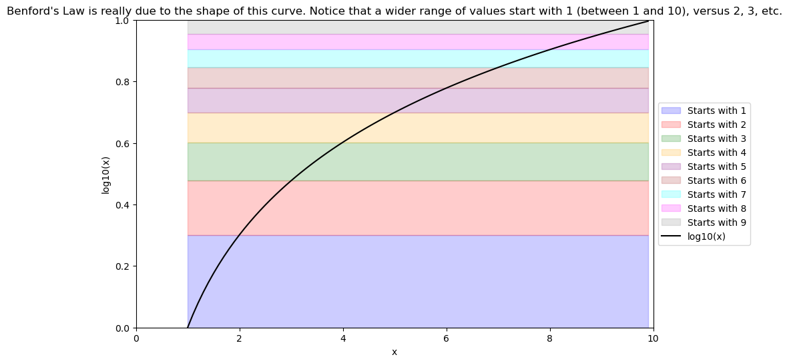

# Benford's Law



A tutorial on how Benford's Law, a characteristic distribution of naturally occurring measurements, emerges out of multiplicative processes. Benford's Law is often used in fraud detection.

## Overview

Benford's Law predicts the frequency distribution of the first digits in many real-life sets of numerical data. According to this law, lower digits occur more frequently as leading digits than higher digits. For instance, the number 1 appears as the leading digit about 30% of the time, while 9 appears as the leading digit less than 5% of the time. This counterintuitive phenomenon can be explained by the logarithmic nature of data spanning multiple orders of magnitude.

### Applications

- **Fraud Detection**: Benford's Law is used to detect anomalies in financial data, election results, and other datasets where the distribution of first digits should conform to the law.
- **Data Analysis**: It helps in analyzing natural phenomena, financial records, and demographic data, ensuring the integrity and authenticity of datasets.

## Getting Started

### Prerequisites

To run the notebook and reproduce the analysis, you need to have Python installed along with the following libraries:

- `requests`
- `beautifulsoup4`
- `yfinance`
- `matplotlib`
- `numpy`

### Installation

You can install the required libraries using the provided `requirements.txt` file. Use the following command:

```bash
pip install -r requirements.txt
```

### Running the Notebook

1. Clone the repository:

   ```bash
   git clone https://github.com/galenwilkerson/Benfords-Law.git
   cd Benfords-Law
   ```

2. Install the dependencies:

   ```bash
   pip install -r requirements.txt
   ```

3. Open the Jupyter notebook:

   ```bash
   jupyter notebook "Benford's Law, Scale-Invariance, and Applications in Fraud Detection.ipynb"
   ```

4. Run the cells in the notebook to see how Benford's Law is demonstrated and applied to various datasets.

## Contents

- **Benford's Law Explanation**: An intuitive and mathematical explanation of Benford's Law.
- **Data Collection**: How to programmatically fetch financial data from Yahoo Finance using the `yfinance` library.
- **Data Analysis**: Analyzing the leading digit distribution and comparing it to Benford's Law.
- **Visualization**: Plotting the observed data against the expected distribution according to Benford's Law.

## Conclusion

By following the steps in this tutorial, you will understand how Benford's Law can be observed in real-world data and its applications in detecting anomalies and ensuring data integrity.
